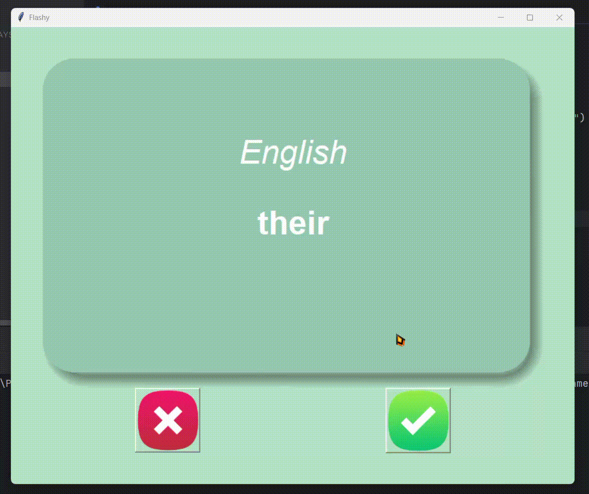

# Python Quiz Game 🧠🎮

A simple yet engaging **Python-based Quiz Game** built using the console. The game asks multiple-choice questions, evaluates answers, and provides the final score.

---

## Demo / Preview



---

## Table of Contents

- [Features](#features)  
- [Project Structure](#project-structure)  
- [Game Rules](#game-rules)  
- [Installation](#installation)  
- [Running the Game](#running-the-game)  
- [Usage](#usage)  
- [Future Improvements](#future-improvements)  
- [Contributing](#contributing)  
- [License](#license)  

---

## Features

- Console-based interactive quiz.  
- Multiple-choice questions with clear options.  
- Immediate feedback after each answer.  
- Tracks score throughout the game.  
- Beginner-friendly Python project.  

---

## Project Structure

```
py-quiz-game/
│── quiz_game.py        # Main script to run the quiz
│── questions.json      # Stores quiz questions and options (if applicable)
│── Demo.png            # Screenshot of the game
│── README.md           # Project documentation
```

---

## Game Rules

- The game presents multiple-choice questions one by one.  
- Player selects the answer by entering the correct option (e.g., A, B, C, or D).  
- Each correct answer earns **1 point**.  
- Final score is displayed at the end of the game.  

---

## Installation

1. Clone this repository:
   ```bash
   git clone https://github.com/ShaileshLambode/py-quiz-game.git
   ```
2. Navigate to the project folder:
   ```bash
   cd py-quiz-game
   ```
3. Make sure you have Python 3 installed:
   ```bash
   python --version
   ```

---

## Running the Game

Run the following command to start the game:
```bash
python quiz_game.py
```

---

## Usage

- Start the script to begin the quiz.  
- Answer the questions by typing the correct option.  
- At the end, your total score will be displayed.  

---

## Future Improvements

- Add more questions from external files (e.g., JSON or database).  
- Introduce difficulty levels (easy, medium, hard).  
- Timer-based answering for extra challenge.  
- GUI-based version using Tkinter or PyQt.  

---

## Contributing

Contributions are welcome!  
1. Fork the repository.  
2. Create a new branch (`feature-branch`).  
3. Commit your changes.  
4. Push and create a Pull Request.  

---

## License

This project is licensed under the [MIT License](LICENSE).  
